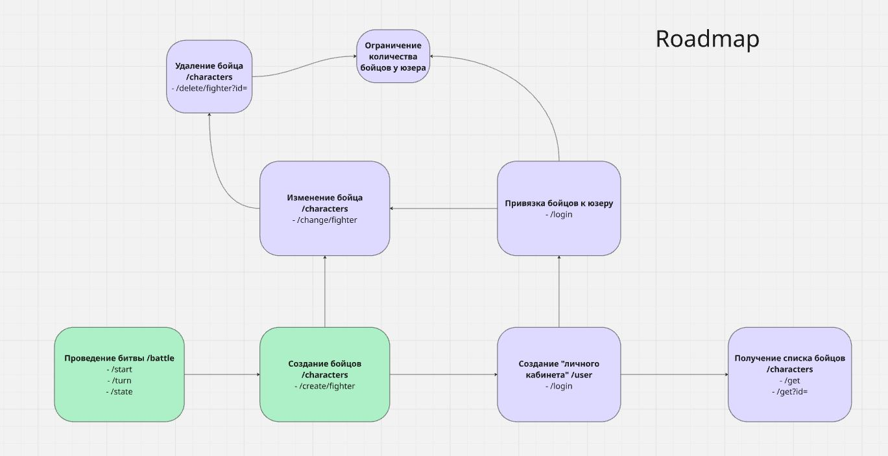

**FastAPI + PostgreSQL**

## ✨ Фичи
- `POST /characters/create/fighter` — создание бойцов
name: "Гоблин" (2-40 символов)
max_hp: (1-1000)
max_attack: (1-1000)
- `POST /battle/start` — начало битвы
fighter1_id: 1 
fighter2_id: 2
- `POST /battle/turn` — сделать ход битвы
battle_id:
- `POST /battle/state` - Получить информацию о битве без изменения состояния
battle_id:

## 🗺️ Roadmap

## 📋 Документация
| 🧪 Тест-кейсы | [Google Docs](https://docs.google.com/spreadsheets/d/1SIwXQGknVGuJYWCku9tJe4EnazXV64RHh4u2iRi-Q3M/edit?usp=sharing) |
| 📊 Postman | [Скачать](docs/Arena.postman_collection.json) |